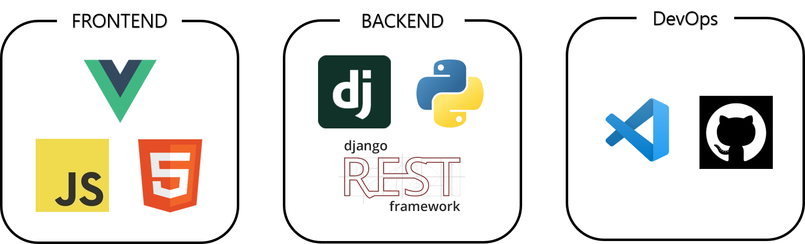
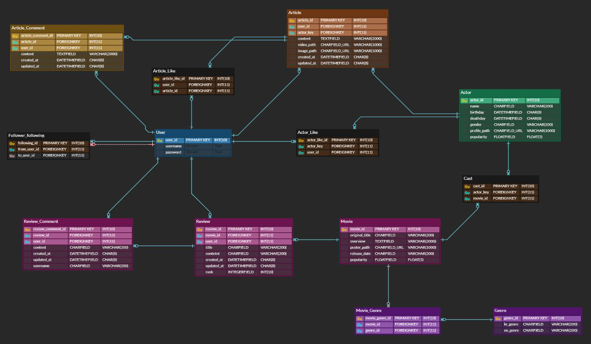
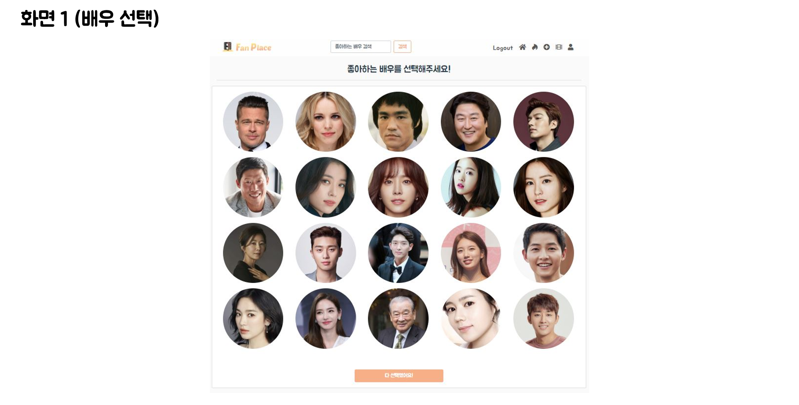
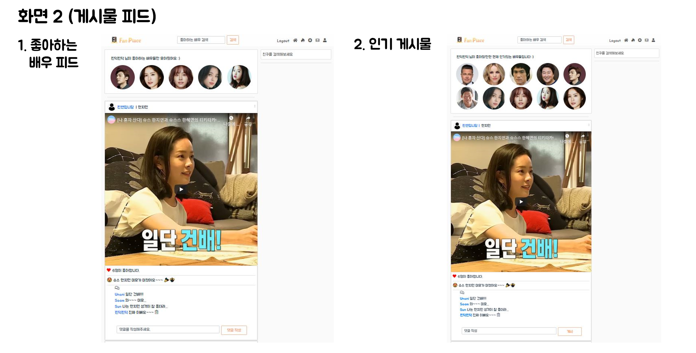
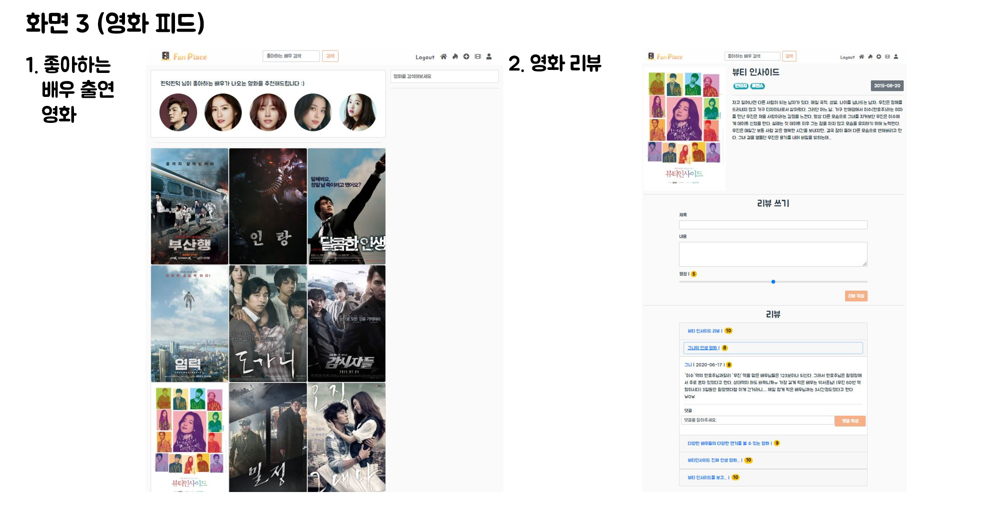

<h1 align="center">Welcome to FanPlace 👋</h1>

  
  

> **배우의 팬들을 위한 최고의 덕질 공간, FanPlace**🎬
>
>  
>
> **Collect** 
>
> FanPlace에서는 내가 좋아하는 배우의 컨텐츠만 쏙쏙 골라 편하게 즐길 수 있습니다.
>
>  
>
> **Share**
>
> 좋아하는 배우의 Charming Point를 쉽게 기록하고 친구들과 공유해보세요!
>
>  
>
> **Connect**
>
> FanPlace를 탐험하다가 새롭게 매력적인 배우에 빠지게 될지도 몰라요😍

 

## 🏠 [FanPlace 즐기기](https://fanplace.netlify.app/)

 

## Introduce Video

[**소개 영상**](https://youtu.be/v7X_h15Ix1c)

 

## Tech Stack

 

## Environment

### FRONT

- Vue (4.3.1)
- bootstrap (4.5.0)

### BACKEND

- Python (3.7.6)
- Django (2.1.15)
- DjangoRestFramework (3.11.0)

 

## Directory

FRONTEND
    
<pre>
│  babel.config.js
│  package-lock.json
│  package.json
│              
├─public
│      
└─src
    ├─api
    ├─assets
    ├─components
    ├─router
    ├─store
    └─views
        ├─accounts
        ├─actors
        ├─articles
        ├─movies
        │  └─reviews
        └─searchbars
</pre>

BACKEND
    
<pre>
│  manage.py
│  requirements.txt
│  
├─accounts
│  │  admin.py
│  │  apps.py
│  │  models.py
│  │  serializers.py
│  │  tests.py
│  │  urls.py
│  │  views.py
│  │  __init__.py
│  │  
│  └─migrations
│          
├─actors
│  │  admin.py
│  │  apps.py
│  │  models.py
│  │  serializers.py
│  │  tests.py
│  │  urls.py
│  │  views.py
│  │  __init__.py
│  │  
│  └─migrations
│          
├─articles
│  │  admin.py
│  │  apps.py
│  │  models.py
│  │  serializers.py
│  │  tests.py
│  │  urls.py
│  │  views.py
│  │  __init__.py
│  │  
│  └─migrations
│          
├─movies
│  │  admin.py
│  │  apps.py
│  │  models.py
│  │  serializers.py
│  │  tests.py
│  │  urls.py
│  │  views.py
│  │  __init__.py
│  │  
│  ├─fixtures
│  │      
│  └─migrations
│          
└─scenephile_django
     │  settings.py
     │  urls.py
     │  wsgi.py
     └  __init__.py
</pre>

 

## Author

👤 [**황수민**](https://github.com/smhwang0109) 

- 백엔드 (Django Rest Framework)
  - Article, Actor 파트 모델링
- 프론트엔드 (Vue Js)
  - Article, Actor 파트 기능 구현

👤 [**박선환**](https://github.com/SunHwan-Park)

- 백엔드 (Django Rest Framework)
  - Movie, User 파트 모델링 및 기능 구현
- 프론트엔드 (Vue Js)
  - Movie, User 파트 기능 구현

 

## DB ERD

 

## Features

 

## 📝 License

Copyright © 2020 [smhwang0109](https://github.com/smhwang0109). 

***
